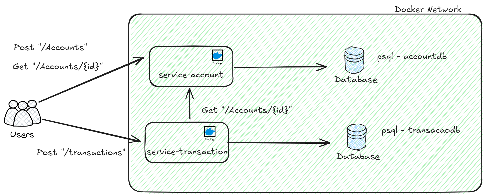

<h1 align="center">
  <br>
  
  <br>
  Tech Assessment
  <br>
</h1>

<h4 align="center">Problem: Customer Account & Transactions.</h4>

<p align="center">
  <a href="#About">About</a> •
  <a href="#Technologies">Technologies</a> •
  <a href="#Requirements">Requirements</a> •
  <a href="#Folders">Folders</a> •
  <a href="#related">How to Use</a> •
  <a href="#license">License</a>
</p>

## About

The project was created as part of technical assessment for a SW Engineer Position.

* Architechture that I proposed for this problem:



## Technologies

* Java - 17
* Docker
* Maven - 3.7+
* Postgres
* Spring - 3.3

## Requirements

* Docker
* Git
* Java
* Maven

## Folders

* /app
    * /service-account
    * /service-transaction
* /infra
    * /init-db

## How To Use

To clone and run this application, you'll need [Git](https://git-scm.com) and [Docker](https://www.docker.com/):

> **Note**
> If you're using Git Bash for Windows, but you can use prompt cmd as well.

```bash
# Clone this repository
$ git clone https://github.com/devflamenbaum/assessment.git

# Go into the repository
$ cd ./assessment
```

To Start you need to go to `infra` folder and start the postgres/pgadmin container via `docker compose`

> **Note**
> Make sure your docker is up and running.

```bash
# Check wheter docker is running or not
$ docker version

# Go into infra folder
$ cd ./infra

# Run docker compose in detach mode
$ docker-compose up -d
```

Now you have the database and a GUI, you can access the interface: [pgadmin](http://localhost:8080). 

> **Note**
> Pgadmin default credentials, username: admin@example.com, password: adminpassword (you can create or change this credentials by modify the docker-compose.yml)

> **Note 2**
> All database, tables and scripts for this challenge has already run! Check `./init-db` for futher info.

From the `app` folder, start to build each microservice image by running:

```bash

# fisrt build

# Go to service-account microservice folder
$ cd service-account

# Build the image - it can take a while (first build)
$ docker build -t service-account .

# Second Build

# Go back to app and then go to service-transaction microservice folder
$ cd ..

$ cd service-transaction

# Build the image - it can take a while (first build)
$ docker build -t service-transaction .

```

Now you are ready to launch, both microservices:
> **Note**
> You can run in detach mode or open 2 terminal for each docker run to check app logs

```bash

# first run (service-account) - need to type exact this command

$ docker run -p 8081:8081 --network infra_pismo-network --name serviceAccount service-account 

# --network infra_pismo-network, it run in the same docker network
# --name serviceAccount has to be this name, otherwise service-transaction can`t do a request
```

```bash

# first run (service-account) - need to type exact this command

$ docker run -p 8082:8082 --network infra_pismo-network --name serviceTransaction service-transaction

# --network infra_pismo-network, it run in the same docker network
# --name serviceTransaction (optional), docker will infer
```

<strong>Now it is running :) </strong>


## License

MIT

---


